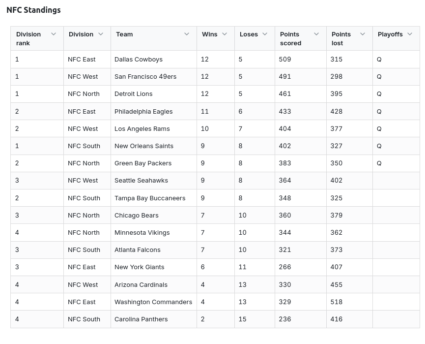
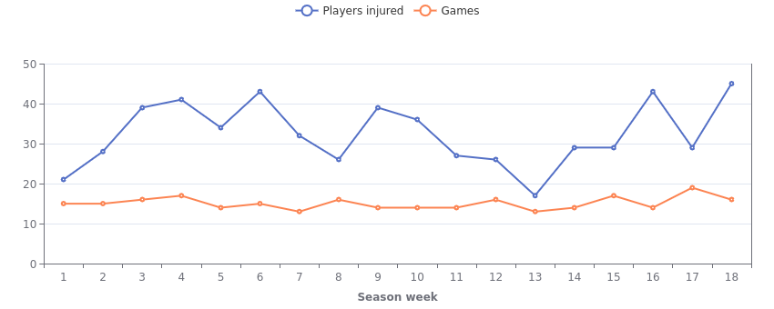
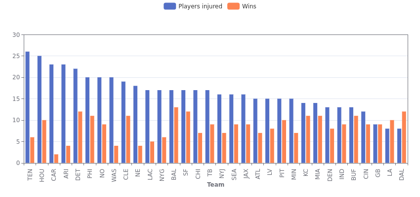
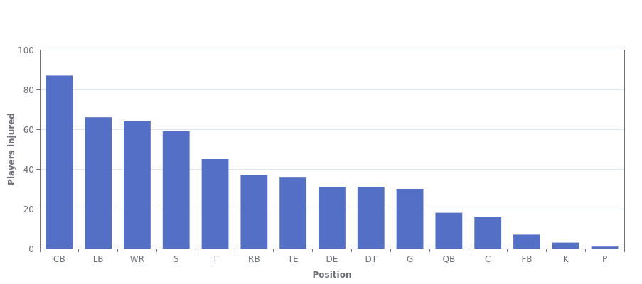
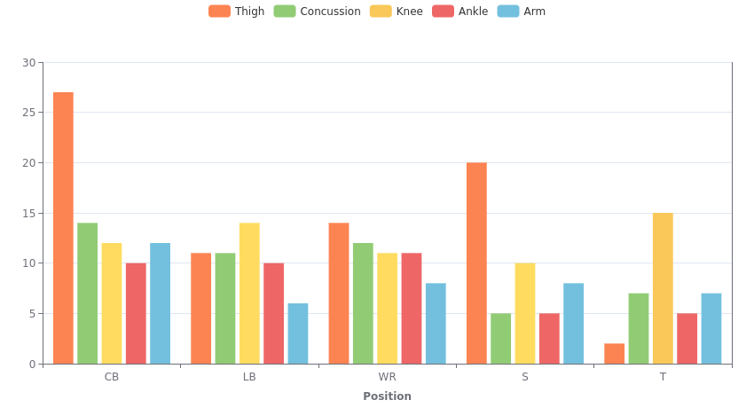

# dbt™ Data Modeling Challenge - Fantasy Football Edition

## Table of Contents
1. [Introduction](#introduction)
2. [Data Sources](#data-sources)
3. [Methodology](#methodology)
4. [Visualizations](#visualizations)
   - [Step One: Understanding the Rules and the Data](#step-one-understanding-the-rules-and-the-data)
      - [Reconstructing the Season Results](#reconstructing-the-season-results)
      - [Game Duration and Overtime](#game-duration-and-overtime)
      - [Does Home-Field Advantage Matter?](#does-home-field-advantage-matter)
      - [Just How Big Are NFL Players?](#just-how-big-are-nfl-players)
   - [Injuries in the 2023 Season](#injuries-in-the-2023-season)
      - [Injury Trends by Week](#injury-trends-by-week)
      - [Do Injuries Affect Team Performance?](#do-injuries-affect-team-performance)
      - [Which Injuries Are Most Common?](#which-injuries-are-most-common)
      - [How Long Do Injuries Keep Players Out?](#how-long-do-injuries-keep-players-out)
      - [Analyzing Injuries by Position](#analyzing-injuries-by-position)
      - [Who Gets the Most Concussions and Common Injuries?](#who-gets-the-most-concussions-and-common-injuries)
5. [Conclusions](#conclusions)

## Introduction

I have a confession to make: I’m not American, and I’m not a sports fan. So when I decided to take on this NFL Data Modeling Challenge, I knew I was in for an uphill battle. My knowledge of (American) football before this challenge was very limited. I knew that:  

- The NFL is the most popular sport in the U.S.  
- They play with an egg-shaped ball.  
- The players are **HUGE**.  
- Concussions are a common injury.  
- The Super Bowl is a really big deal.  

My goal was to get familiar with the data and analyze injuries—especially concussions. I’d heard they were a big concern in football, so I wanted to see how common they actually were. Were certain positions more at risk? 

## My Lightdash Dashboards
[Dashboard 1: Getting to know data](https://app.lightdash.cloud/projects/36657ff5-d0ec-483b-98ad-eb25393cb88c/dashboards/1952d76f-0aad-4234-a6cf-290f5628f897/view)

[Dashboard 2: NFL Injuries in 2023](https://app.lightdash.cloud/projects/36657ff5-d0ec-483b-98ad-eb25393cb88c/dashboards/4b526e28-a13d-45bb-83f8-14efd23b7e4c/view)

## Data Sources

I used the following data sources:  

- **Fantasy Football Data (Snowflake)** (provided by the organizers):  
  - **Play-by-play data** – Detailed records of every play in a game, including actions, outcomes, and player involvement.  
  - **Player stats by game** – Aggregated player performance metrics for each game.  

Additionally, I used two datasets from the **nfl_data_py** Python package:  
- **NFL Teams Data Set** for team descriptions.  
- **NFL Injuries Data Set** for injury data from the **2023 season**.

## Methodology
### Tools Used
- Paradime for dbt™ modeling and SQL
- Snowflake for data warehousing
- Lightdash for visualization
- ChatGPT as my go-to football expert and for crafting this narrative

### Applied Techniques  

I used SQL, dbt, and Snowflake to build the core entities from the provided data sources:  

- Player info and stats  
- Game results  
- Team standings  
- Injury stats  

After modeling the data, I used Lightdash for exploration and visualizations.  

## Visualizations

### Step One: Understanding the Rules and the Data  

Before jumping into any data modeling, I had to get a grasp on how the NFL actually works. I learned that the league is split into two conferences: the AFC (American Football Conference) and the NFC (National Football Conference). Each conference has **16 teams**, further divided into **four divisions of four teams each**.  

The season itself is split into the **regular season** and the **playoffs**. By the end of the regular season, **seven teams from each conference** qualify for the playoffs, leading up to the Super Bowl.  

Scoring was another challenge to wrap my head around. You get **6 points for a touchdown**, **3 points for a field goal**, and a few other ways to score that I’m still trying to fully grasp. Let’s just say football rules are not as intuitive as I had hoped!  

#### Reconstructing the Season Results  

For my first real analysis, I aimed to recreate the results of each game and compile the **final standings for the AFC and NFC** after the 2023 regular season. I included:  

- Number of wins and losses for each team
- Total points scored and allowed  
- Who qualified for the playoffs

The good news? My data lined up with what I found on Wikipedia—so at least I didn’t mess up too badly!  

#### Game Duration and Overtime  

I learned that each game consists of **four 15-minute quarters**, and if the game is tied at the end, there can be **overtime**.  

So, how often does a game actually go into overtime? Here’s what I found:  

- Out of 272 regular season games, 259 ended in regulation, while 13 went into overtime—that’s roughly **95% regular time, 5% OT**.  
- In the playoffs, 12 games ended in regular time, while 1 went to overtime, making it **92% vs. 8%**.  

This suggests that overtime is relatively rare. Here are the visualizations of how often games extend beyond regulation:  

#### Does Home-Field Advantage Matter?

Next, I looked into how often the **home team wins** compared to the **away team**.  During the **regular season**, home teams won **55%** of the time, while away teams took **45%** of the victories. The advantage is there, but it’s not overwhelming.  

However, in the **postseason**, the gap widened significantly—**home teams won 77%** of the time, leaving away teams with just **23%** of the wins. This suggests that home-field advantage might play a much bigger role in the playoffs.  

#### Just How Big Are NFL Players?
Finally, I analyzed the average height and weight for each position—and let me tell you, there are a lot of positions.

To make sense of the data, I included reference lines at 100 kg (220 lbs) and 140 kg (308 lbs) for weight, and 190 cm (6’3”) and 200 cm (6’7”) for height—helpful for those of us using the metric system.

The results? All players are undeniably large, but there’s quite a range. Some positions have players who are "normal-sized" humans, while others are absolute giants. It’s fascinating to see how different body types fit into different roles on the field!

#### Insights

- **Football rules are complicated**—I learned the basics, but there’s a lot to keep track of.  
- **Overtime is rare**—only around 6-8% went beyond regulation time.  
- **Home teams have an advantage**, winning 55% of regular season games and a dominant 77% in the playoffs.  
- **NFL players are huge**, but size varies by position—some are within "normal human" range, while others are absolute giants, often exceeding 140 kg (308 lbs) and 200 cm (6'7").

### Injuries in the 2023 Season

For the next part of my analysis, I focused on **injuries**. I imported 2023 injury data from the `nfl_data_package`, which only includes injuries from the **regular season**, so that’s what I’ll be analyzing here.  

To keep things focused, I only looked at **serious injuries**—specifically, injuries that caused a player to be marked **OUT** for that week’s game.  

I simplified the data by only counting the first reported injury for each player and injury type. If the same injury appeared in later weeks, I assumed it was a continuation or recurrence rather than a new injury. Of course, this is an oversimplification, but it helps provide a clear picture of the overall trends.  

### **Injury Trends by Week**  

The first thing I looked at was how many players were **first reported as injured each week**.  I noticed a fairly steady trend, with around 30-35 players getting injured per week. There was, however, a slight dip around Week 13.

This could be explained by the fact that Week 13 falls around Thanksgiving, possibly leading to fewer injuries due to the holiday spirit—or maybe just coincidence. Another factor could be the slightly lower number of games played that week, which naturally means fewer chances for injuries. Or perhaps players somehow managed to take it easy for the holidays, though that seems unlikely in the NFL.

Here’s a visualization showing both the number of new injuries and the number of games played each week:

### Do Injuries Affect Team Performance?

Next, I compared the number of injured players per team to the number of wins each team had in the regular season. You’d expect that teams with more injuries would struggle more, but the relationship isn’t that straightforward.  

There’s no clear correlation—teams with a higher number of injured players tend to have fewer wins, but it’s not a hard rule. Some teams managed to perform well despite a high number of injuries, while others with relatively fewer injuries still didn’t win many games.  

Here’s a visualization of the relationship between injuries and wins:  

### Which Injuries Are Most Common?

I looked at which types of injuries happened most often and which parts of the body were affected the most. The results weren’t too surprising—legs take the most damage.  

Knee injuries were the most common, followed by thigh injuries (quadriceps and hamstrings). Concussions came in third, with ankle injuries in fourth. The graph below shows how many players suffered injuries to each body part during the regular season.  

### How Long Do Injuries Keep Players Out?

Next, I analyzed how long different injuries typically last by counting how many weeks a player was marked out. This led to my biggest surprise: concussions are not the longest-lasting injury.  

On average, players were out for 1.4 weeks with a concussion, while foot, thigh, ankle, knee injuries, and even illnesses kept players sidelined for longer.  

This made me wonder—does the NFL not take concussions seriously enough, or are even mild concussions being reported? I don’t have the medical expertise to say, but it definitely stood out.

### Analyzing Injuries by Position  

Next, I wanted to break injuries down by position to see which players were most affected. The results were pretty interesting.  

Cornerbacks (CB) had the highest number of injuries, with **87** players sidelined. Linebackers (LB), wide receivers (WR), and safeties (S) weren’t far behind, with **66, 64, and 59** injured players, respectively. Tackles (T) rounded out the top five with **45** injuries.   

I looked at injuries for the positions with the highest injury counts:  

- Cornerbacks were most affected by thigh injuries.  
- Linebackers and wide receivers had a fairly even spread of injuries, with linebackers most affected by knee injuries and wide receivers by thigh injuries.  
- Safeties were also most affected by thigh injuries.  
- Tackles had the most injuries in the knee.

### Who Gets the Most Concussions and Common Injuries?  

I analyzed which positions had the highest counts of the most common injuries—thigh, knee, concussions, and ankle injuries—to see which player roles were most affected by each type.

### Concussions by positions

Concussions were most common among cornerbacks, wide receivers, and linebackers.

 

### 

Thigh injuries were most frequent for cornerbacks, safeties, and wide receivers.

 

### Knee injuries by positions

Knee injuries were most common among tackles, linebackers, and cornerbacks.

 

### Ankle injuries by positions

Ankle injuries affected wide receivers, linebackers, cornbacks, and running backs the most.

 

| **Concussions by positions**                                                  | **Thigh injuries by positions** | 
|---------------------------------------------|---------------------------------------------|
| Concussions were most common among cornerbacks, wide receivers, and linebackers. | Thigh injuries were most frequent for cornerbacks, safeties, and wide receivers. |
|   |   |
|---------------------------------------------|---------------------------------------------|
|   |   |

### Insights

- **Leg injuries dominate**—knee and thigh injuries are the most common, followed by concussions and ankle injuries.  
- **Injuries don’t always predict team performance**—teams with more injuries tend to win less, but there’s no strict correlation.  
- **Concussions don’t sideline players for long**—on average, players miss only **1.4 weeks** for a concussion, while foot, thigh, ankle, and knee injuries, as well as illnesses, take longer to recover from.  

## Conclusions

This analysis showed me that familiarity with the subject—like game rules and terminology—is crucial for in-depth and meaningful data analysis.  

It also raised more questions than answers. For example, why do concussions sideline players for an average of 1.4 weeks, while foot injuries keep them out for 2 weeks? I don’t have the knowledge to explain that.
