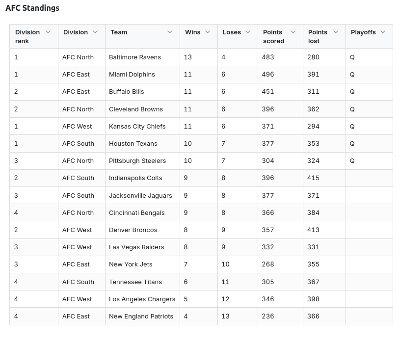
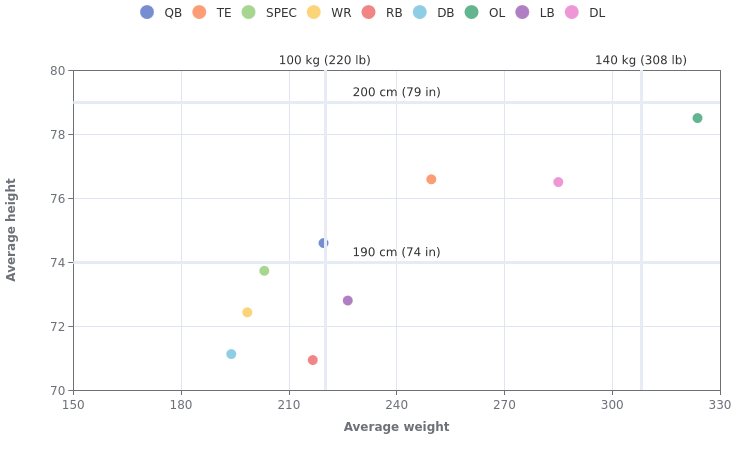

# dbt™ Data Modeling Challenge - Fantasy Football Edition

## Table of Contents
1. [Introduction](#introduction)
2. [Data Sources](#data-sources)
3. [Methodology](#methodology)
4. [Visualizations](#visualizations)
   - [Step One: Understanding the Rules and the Data](#step-one-understanding-the-rules-and-the-data)
      - [Reconstructing the Season Results](#reconstructing-the-season-results)
      - [Game Duration and Overtime](#game-duration-and-overtime)
      - [Does Home-Field Advantage Matter?](#does-home-field-advantage-matter)
      - [Insights](#insights-1)
5. [Insights](#insights)
6. [Conclusions](#conclusions)

## Introduction

I have a confession to make: I’m not American, and I’m not a sports fan. So when I decided to take on this NFL Data Modeling Challenge, I knew I was in for an uphill battle. My knowledge of (American) football before this challenge was... let’s just say, "limited." I knew that:  

- The NFL is the most popular sport in the U.S.  
- They play with an egg-shaped ball.  
- The players are **HUGE**.  
- Concussions are a common injury.  
- The Super Bowl is a really big deal.  

That was pretty much it.  

[Dashboard 1: Getting to know data](https://app.lightdash.cloud/projects/36657ff5-d0ec-483b-98ad-eb25393cb88c/dashboards/1952d76f-0aad-4234-a6cf-290f5628f897/view)

## Data Sources
- Fantasy Football Data (Snowflake):
   - play-by-play data
   - player stats by game data

Additional datasets:
- NFL Teams Data Set - Team description from nfl_data_py Python package
- NFL Injuries Data Set - Injury data for the 2023 season from nfl_data_py Python package

## Methodology
### Tools Used
- Paradime for dbt™ modeling and SQL
- Snowflake for data warehousing
- Lightdash for visualization
- ChatGPT as my go-to football expert and for crafting this narrative

### Applied Techniques
[Discuss transformations, tests, and models built]

## Visualizations

### Step One: Understanding the Rules and the Data  

Before jumping into any data modeling, I had to get a grasp on how the NFL actually works. I learned that the league is split into two conferences: the AFC (American Football Conference) and the NFC (National Football Conference). Each conference has **16 teams**, further divided into **four divisions of four teams each**.  

The season itself is split into the **regular season** and the **playoffs**. By the end of the regular season, **seven teams from each conference** qualify for the playoffs, leading up to the Super Bowl.  

Scoring was another challenge to wrap my head around. You get **6 points for a touchdown**, **3 points for a field goal**, and a few other ways to score that I’m still trying to fully grasp. Let’s just say football rules are not as intuitive as I had hoped!  

#### Reconstructing the Season Results  

For my first real analysis, I aimed to recreate the results of each game and compile the **final standings for the AFC and NFC** after the 2023 regular season. I included:  

- Number of wins and losses for each team
- Total points scored and allowed  
- Who qualified for the playoffs

The good news? My data lined up with what I found on Wikipedia—so at least I didn’t mess up too badly!  

#### Game Duration and Overtime  

I learned that each game consists of **four 15-minute quarters**, and if the game is tied at the end, there can be **overtime**.  

So, how often does a game actually go into overtime? Here’s what I found:  

- Out of 272 regular season games, 259 ended in regulation, while 13 went into overtime—that’s roughly **95% regular time, 5% OT**.  
- In the playoffs, 12 games ended in regular time, while 1 went to overtime, making it **92% vs. 8%**.  

This suggests that overtime is relatively rare. Here are the visualizations of how often games extend beyond regulation:  

#### Does Home-Field Advantage Matter?

Next, I looked into how often the **home team wins** compared to the **away team**.  During the **regular season**, home teams won **55%** of the time, while away teams took **45%** of the victories. The advantage is there, but it’s not overwhelming.  

However, in the **postseason**, the gap widened significantly—**home teams won 77%** of the time, leaving away teams with just **23%** of the wins. This suggests that home-field advantage might play a much bigger role in the playoffs.  

#### Just How Big Are NFL Players?
Finally, I analyzed the average height and weight for each position—and let me tell you, there are a lot of positions.

To make sense of the data, I included reference lines at 100 kg (220 lbs) and 140 kg (310 lbs) for weight, and 190 cm (6’3”) and 200 cm (6’7”) for height—helpful for those of us using the metric system.

The results? All players are undeniably large, but there’s quite a range. Some positions have players who are "normal-sized" humans, while others are absolute giants. It’s fascinating to see how different body types fit into different roles on the field!

#### Insights 1

- **Football rules are complicated**—I learned the basics, but there’s a lot to keep track of.  
- **Overtime is rare**—only around 6-8% went beyond regulation time.  
- **Home teams have an advantage**, winning 55% of regular season games and a dominant 77% in the playoffs.  
- **NFL players are huge**, but size varies by position—some are within "normal human" range, while others are absolute giants, often exceeding 140 kg (310 lbs) and 200 cm (6'7").

## Conclusions
[Summarize key takeaways and recommendations]
